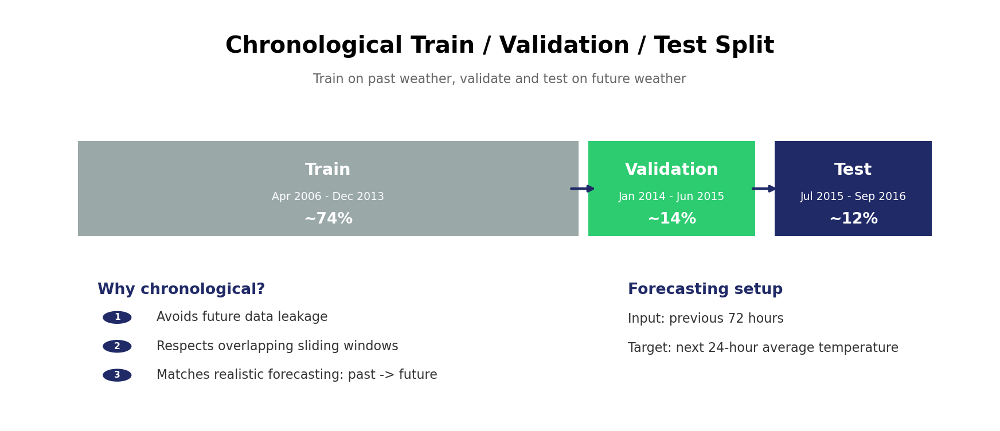
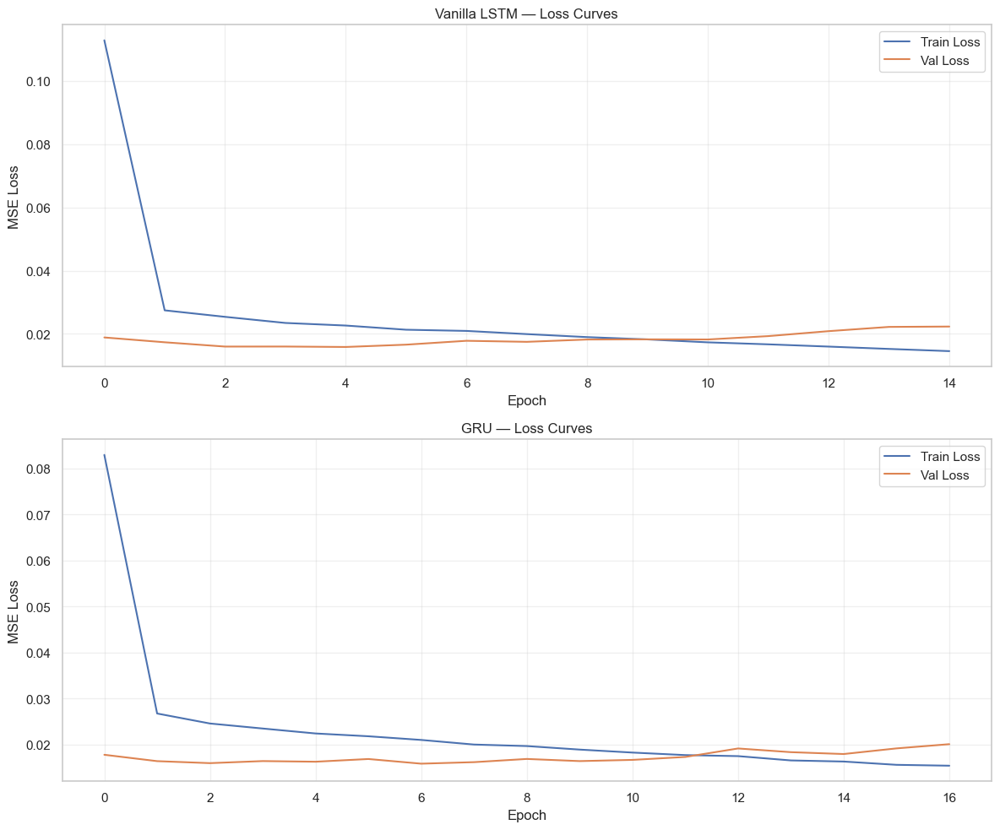
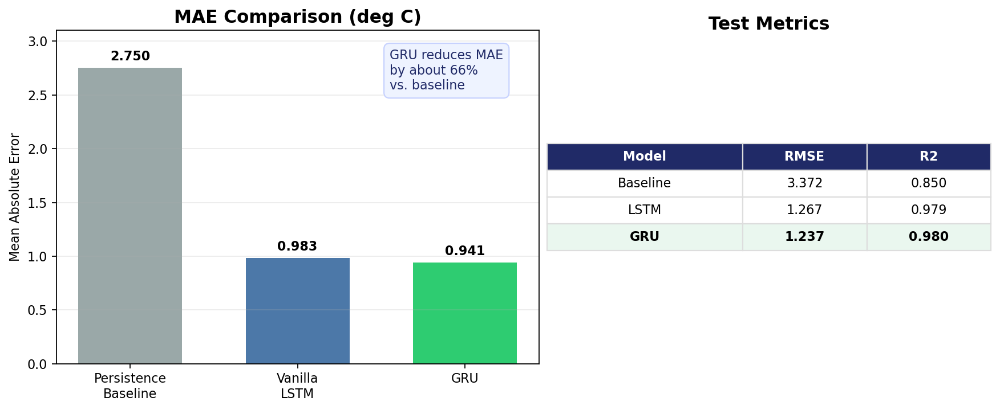
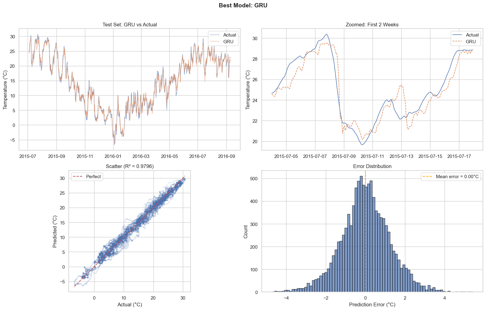
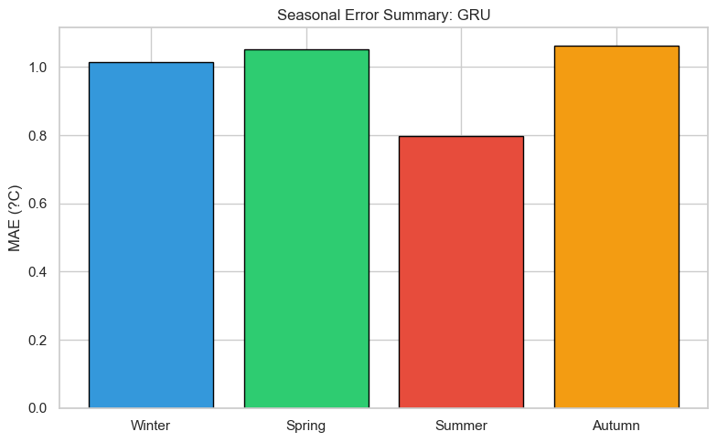

# Szeged Weather Prediction with Deep Learning

Final project for **Deep Learning (Discussion Seminar)**, a Master 2nd Year course in Big Data Science at Kozminski University.

This project predicts the **next-day average temperature** using the previous **72 hours of hourly weather data**. We compare a simple persistence baseline with recurrent neural network models, mainly Vanilla LSTM and GRU.

## Course and Team

| Item | Details |
|---|---|
| Course | Deep Learning (Discussion Seminar) |
| Subject code | DL_BDS |
| Study program | Master, 2nd Year, Big Data Science |
| Class group | ds/DL/MiBDS - 2nd Year |
| Lecturer | Pamela Krzypkowska BA |
| Language | English |
| ECTS | 4 |
| Team | Youngjun Son, Emma Hope |

## Project Goal

The original project option was based on weather prediction for Szeged. For the final implementation, we expanded the data source and used hourly weather data collected through Open-Meteo for Szeged and five nearby cities:

- Szeged
- Budapest
- Debrecen
- Pecs
- Belgrade
- Timisoara

The prediction task is a **regression problem** because the target is a continuous temperature value, not a class label.

## Notebook Workflow


## 1. Data Preparation

The notebook first checks whether the city-level hourly datasets are complete, aligned by date, and consistent across features. The main weather variables include temperature, humidity, pressure, precipitation, wind speed, and wind direction.

One important preprocessing step is converting wind direction from a circular compass value into sine and cosine components. This avoids treating 350 degrees and 10 degrees as far apart when they are actually close on a compass.

## 2. Chronological Split

Because this is a forecasting task, we avoid random splitting. The model should train on past observations and be evaluated on future observations, just like a real weather forecasting setup.



The final split is approximately:

| Split | Period | Share |
|---|---|---:|
| Train | Apr 2006 - Dec 2013 | ~74% |
| Validation | Jan 2014 - Jun 2015 | ~14% |
| Test | Jul 2015 - Sep 2016 | ~12% |

## 3. Sliding Window Setup

Each training sample uses:

- **Input X:** previous 72 hours of weather data
- **Target y:** average temperature over the next 24 hours

Using a sliding window produces around **67,872 training windows**, giving the models enough sequential examples to learn from.

## 4. Models

We tested three forecasting approaches:

| Model | Role |
|---|---|
| Persistence baseline | Uses the last observed temperature as a simple benchmark |
| Vanilla LSTM | Recurrent neural network baseline for time-series learning |
| GRU | More compact recurrent model with fewer parameters than LSTM |

GRU was selected as the best model because it produced slightly better predictive performance while using fewer parameters than the LSTM.

## 5. Training Diagnostics

Both neural network models converge quickly. Validation loss stops improving after the early epochs, so the notebook uses **manual early stopping** in PyTorch with `patience=10`.



## 6. Model Performance

The deep learning models clearly outperform the persistence baseline. GRU gives the best overall result in the final notebook run.



The stability check also supports this conclusion. Across three random seeds (`42`, `123`, and `7`), GRU achieved:

| Model | MAE mean +/- std | RMSE mean +/- std | R2 mean +/- std |
|---|---:|---:|---:|
| Vanilla LSTM | 0.964 +/- 0.011 | 1.259 +/- 0.010 | 0.9791 +/- 0.0003 |
| GRU | 0.948 +/- 0.012 | 1.234 +/- 0.012 | 0.9800 +/- 0.0004 |

## 7. GRU Prediction Analysis

The GRU prediction plots show that the model follows both the broad seasonal pattern and many short-term temperature changes. The scatter plot is tightly clustered around the ideal diagonal line, and the error distribution is centered close to zero.



## 8. Seasonal Error Analysis

The seasonal error analysis shows that summer is the easiest season to predict, while colder or transition seasons are more difficult because temperature changes can be less stable.



## Repository Contents

```text
Deep_Learning_Project.ipynb       Final Jupyter notebook
presentation_slide.pdf            Final presentation slides
assets/                           README visualizations
data/meteostat/*.csv              Hourly weather datasets used in the notebook
checkpoints/*.pt                  Saved best model checkpoints
README.txt                        Submission note
```

## How to Run

Open and run:

```text
Deep_Learning_Project.ipynb
```

The notebook expects the CSV files to be available under:

```text
data/meteostat/
```

## AI Tools Disclosure

Generative AI tools were used as support for debugging, checking explanations, improving presentation wording, and preparing final submission materials. The project team reviewed and understood the code, metrics, and conclusions.
